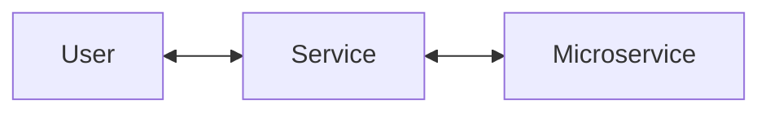

# Golang echo: API gateway pattern
[API Gateway pattern](https://microservices.io/patterns/apigateway.html)




## Run
```bash
# microservice
cd microservice
make docs
make run

# service
cd service
make docs
make run
```

You can use Swagger to test.
- http://localhost:10000/docs/index.html
## Result
- Sum

